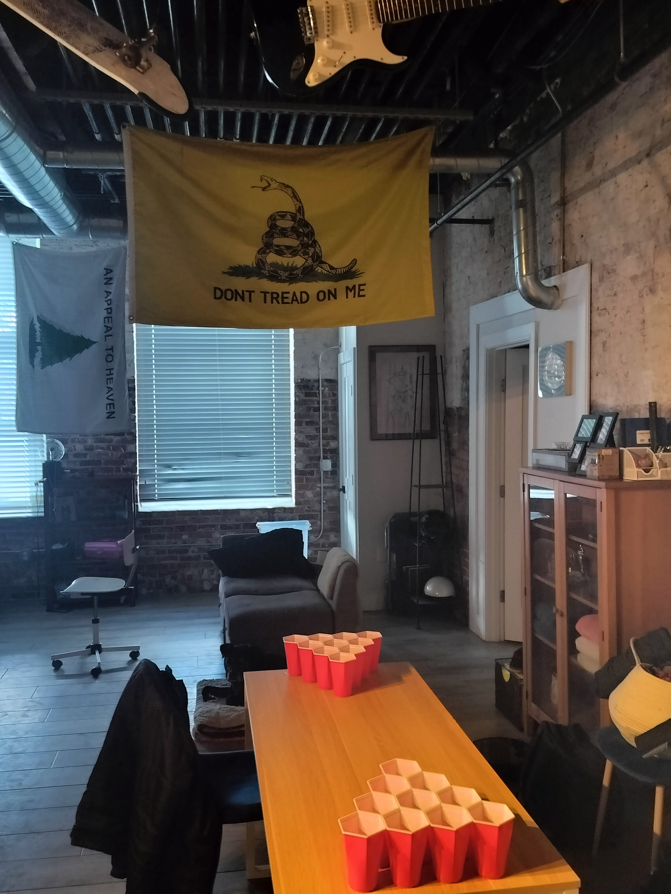

# 🍺 BEER PONG 🍺
## Haverhill Frat Rules

### 📚 Rule Navigation

#### 🎯 Core Rules
- [Basic Setup](setup.md)
    - *cup setup*
    - *re-rack rules*
- [Bounce Shot Rules](Bounces.md)
- [End Game & Redemption](Redemption.md)
- [Swatting and Penalties](swatting-defence-penalties.md)
- [Power-Ups](power-ups.md)
    - *balls of fury*
- [Testamonials](review.md)

#### 🎮 Game Variants
- [Three Cup Monte](three-cup-monte.md) 🍷
  - *Wine-optional mini game with resurrection mechanics*
- [Seven Up Cup](seven-up-cup.md) 🎲
  - *Classic formation with resurrection twist*

#### 🌟 Game Modifiers
- [Hydration Cup & Ice Defense](hydration-cup-ice-mod.md) 🧊
  - *Strategic ice cube mechanics*
  - *Mine field system*
  - *Advanced hydration tracking*
- [King Cup](king-cup.md)
  - *chess-like end-game mechanics*
  - *protect your king*

## ♟️ The Haverhill Difference
While others play beer pong like checkers, we play it like chess. Our rules embrace:
- Strategic depth in every throw
- Complex mind games with resurrection cups
- Tactical ice cube placement
- Risk/reward decision making
- Multi-layered defensive options
- Advanced psychological warfare

*This isn't your typical "throw ball at cup" game - this is sophisticated entertainment for distinguished individuals who appreciate the finer aspects of competitive drinking sports.*

-------------------

#### Est. 2024
#### Version 1.3

*Grab a partner, rack the cups, and may the best team win!* 

🏆 🎯 🍻

-------------------

*Remember: Drink responsibly and always have a designated driver!*
