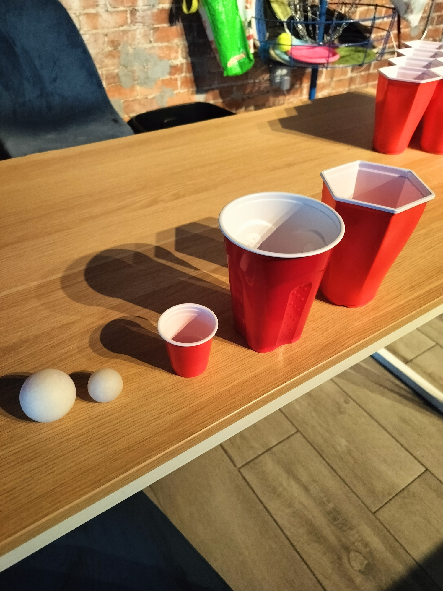

# 👑 King Cup Rules 👑

## 🏰 Setup
- Standard cup formation
- One mini cup ("King") per side
- Kings placed at back center of formation
- Kings can be filled with special drink

## ⚔️ Victory Conditions

### 🎯 Regicide (Instant Win)
- Hitting opponent's King cup
- No redemption allowed
- Royal victory celebration required
- "The King is dead, long live the victor!"

### 🗡️ Patricide (Instant Loss)
When defender causes their own King's demise:
- Any self-caused King cup spill
- Knocking over during re-racking
- Failed defense attempts
- Automatic loss of royal status

## 👑 King Protection Rules
- King can be defended like any cup
- Moving King cup is treason (instant loss)
- Re-racks must maintain King position
- No sacrificing King to save peasant cups

## 🎭 Royal Etiquette
- Winner must proclaim "Checkmate!"
- Loser must bow to victor
- King hits require royal celebration
- Patricide requires public shame

### ⚜️ Strategic Notes
- Protect your King at all costs
- Target enemy King for glory
- Consider King shots carefully
- Remember: "Heavy lies the crown"

*Note: With great power comes great responsibility... and shame if you knock over your own King* 

🏆 👑 ⚔️