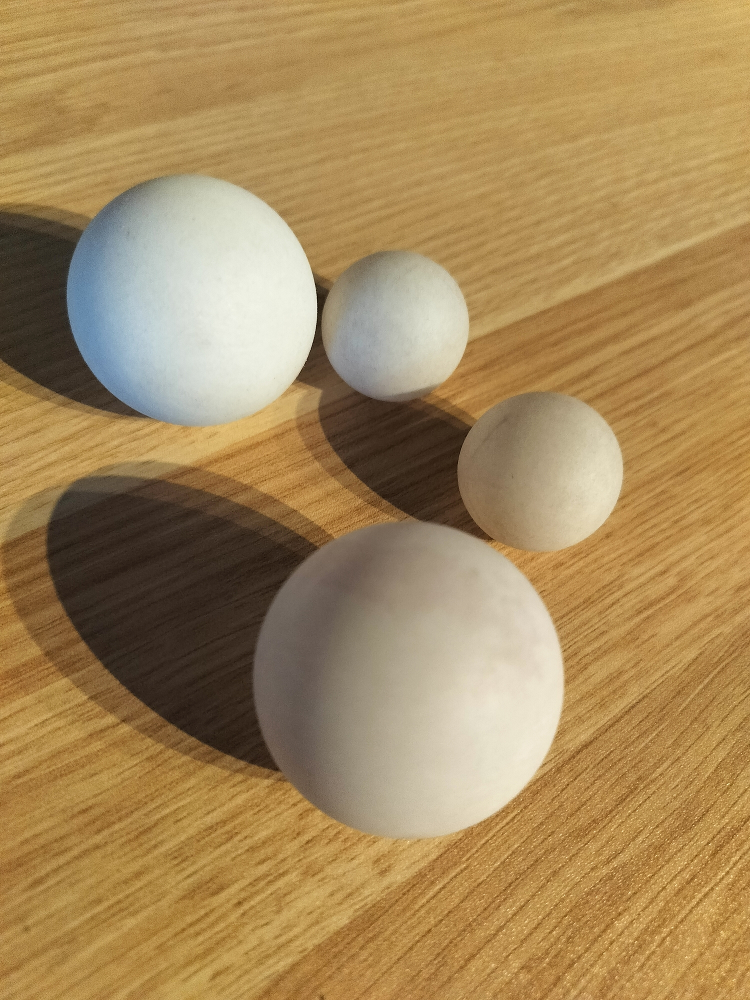

# 🔥 Power-Up Rules 🔥

## 🌟 Current Power-Ups




### 👊 BALLS OF FURY 👊
```
Standard Ball vs Mini Balls
    🏐        🔴🔴
```

#### Activation
- Player must shout "BALLS OF FURY!"
- Must declare before throwing
- No retroactive calls

#### Mechanics
- Two mini balls used
- Can be thrown:
  - Simultaneously
  - Sequential
  - Any creative method
- Counts as ONE turn/shot
- Can be used for either teammate's turn

#### Limitations
- Cannot combine with other power-ups
- Must use both mini balls
- Standard bounce rules apply to each ball
- Standard defense rules apply

#### Strategic Use
- Double chance at hitting
- Great for scattered cups
- High risk, high reward
- Perfect for clutch moments

### 🎳 BOWLORAMA 🎳
```
     🎳
  🎯🎯🎯
   🎯🎯
    🎯
```

#### Activation
- Player must shout "BOWLORAMA!"
- Must use official hoverbowler
- Must set up pins in proper formation
- Counts as entire turn for team

#### Mechanics
- Pins must mirror cup formation
- One bowling attempt allowed
- Cups removed = pins knocked down
- Cups removed are always the same as the pins knocked down, location and all
- No bounces or trick shots allowed

#### Setup Rules
- Pins must be:
  - Clearly visible
  - Properly spaced
  - On stable surface
  - Within regulation distance

#### Strategic Use
- High risk, high reward
- Potential for multiple cups
- Perfect for comeback attempts
- Tests different skill set

#### Limitations
- Cannot combine with other power-ups
- No re-rolls
- No practice shots
- Must complete setup within 30 seconds

*Note: Keep the hoverbowler clean and dry for optimal pin action!* 

⚡️ 🎳 🎯

*"Sometimes you gotta roll the hard six"*

*Note: More power-ups coming soon... stay tuned for updates!* 

### 💫 Future Power-Ups
- Coming Soon...
- Under Development...
- Testing in Progress...

⚡️ 🎯 🎮

*"With great power comes great responsibility... and mini balls"*