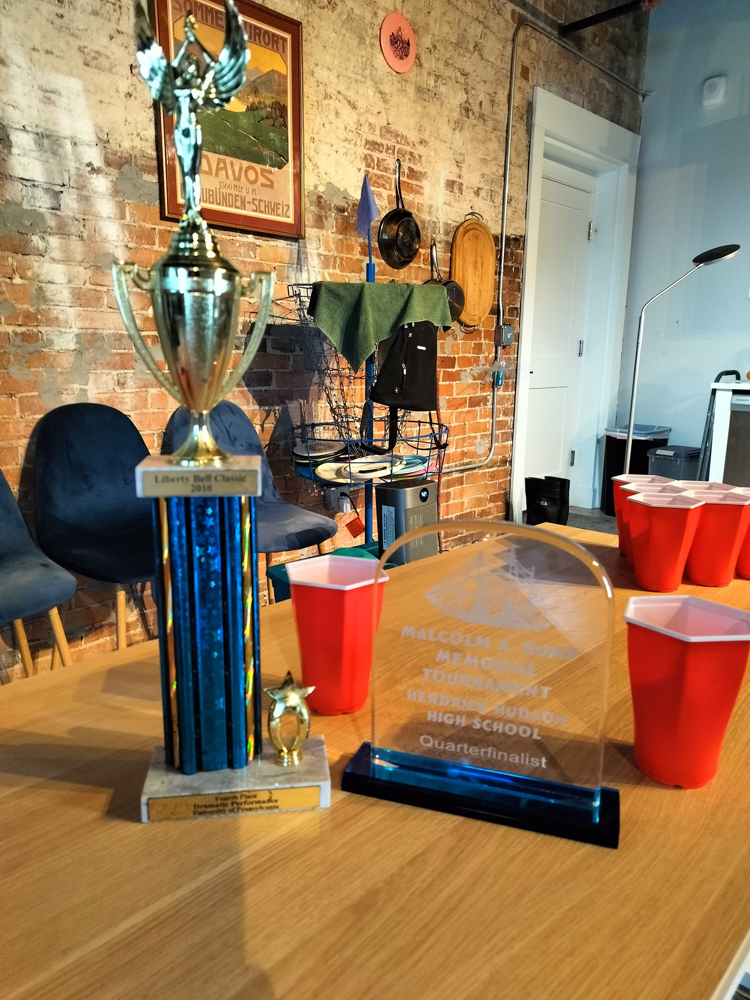

# 🛡️ QUADRISHIELD MODE 🛡️




## 🏆 Shield Loadout
Each team starts with:
- 2x Malcolm A. Bump Trophies
- 2x UPenn Tower Trophies
```
Shield Arsenal:
   🏆🏆
   🗼🗼
```

## 🎯 Game Setup
- 7-Up Cup formation (6+1)
```
     🔴🔴🔴   🧊
      🔴🔴
       🔴    
(Rez cup with ice)
```

### 🧊 Ice Rules
- Ice ONLY in resurrection cup
- Standard ice transfer rules apply
- Creates "Final Boss" cup scenario

## ⚔️ Shield Management
- 4 total shields per team
- Can use in any order
- Cannot use same trophy twice in a row
- Must return to case between uses
- Standard activation calls required:
  - "I INVOKE THE MALCOLM!"
  - "TOWER DEFENSE!"
  or anything else cool.

### 💫 Strategic Elements
- UPenn Tower excels vs arc shots
- Malcolm better for straight shots
- Shield conservation crucial
- Trophy case positioning important
- Ice cup becomes prime target

## ⚠️ Special Conditions
- All standard shield rules apply
- Malcolm drop = 2 cup penalty
- UPenn drop = 3 cup penalty
- Cannot shield inactive rez cup
- Cannot use multiple shields per shot
- Both teammates can use shields

### 🎮 Recommended Stats
- 40% longer games
- 300% more drama
- 100% more trophy handling
- 2x UPenn Tournament flashbacks
- ∞ more style points

*Note: Requires designated trophy handlers and a flair for the dramatic*

🏆 🗼 🧊 

*"Four shields, two trophies, one champion"*