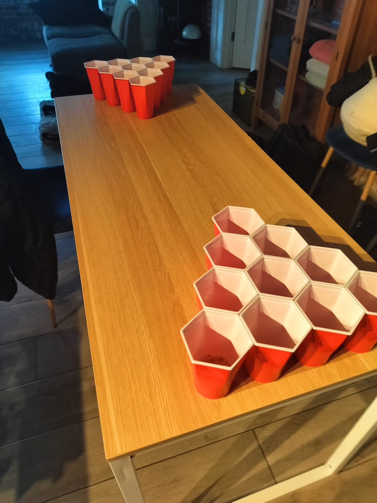

# 🎯 Standard Formation Rules 🎯




## 📐 10 Cup Formation (Classic)
```
     🔴🔴🔴🔴
      🔴👑🔴
       🔴🔴
        🔴
```
- 4-3-2-1 Triangle formation
- King cup centered in 3-cup row (if using)
- Cups must be touching edges
- Rear row cups on back table edge
- Equal cup levels (1/3 cup)

## 📐 6 Cup Formation (Quick Play)
```
       🔴👑🔴
        🔴🔴
         🔴
```
- 3-2-1 Triangle formation
- King cup in back center (if using)
- Cups must be touching edges
- Rear Row aligned on table edge
- Equal cup levels (1/3 cup)

## 🎮 Cup Contact Rules

### 🔷 Hexagonal Cups
- Full edges must be touching
- No corner-only contact
- No gaps between cups
- Perfect honeycomb formation

### ⭕ Round Cups
- Maximum edge contact required
- No visible gaps
- Tight formation required

## 🔄 Re-Rack Rules
- Available at ANY time
- EXCEPT with 2 cups remaining *('with 2 cups, you screwed up')*
- Any formation allowed IF:
  - All cups touching properly
  - Following cup contact rules
  - No excessive delay
- King cup position maintained

### 📏 Formation Examples
- Diamond
- Triangle
- Line
- 'L' Shape
- Box
- Arrow
- *Any creative formation where cups touch properly*

## ⚠️ Common Violations
- Gaps between cups
- Partial edge contact
- Re-racking with 2 cups
- Excessive formation time
- Improper King placement

*Note: If you can see table between cups, your formation is wrong!* 

🎯 🍺 👑